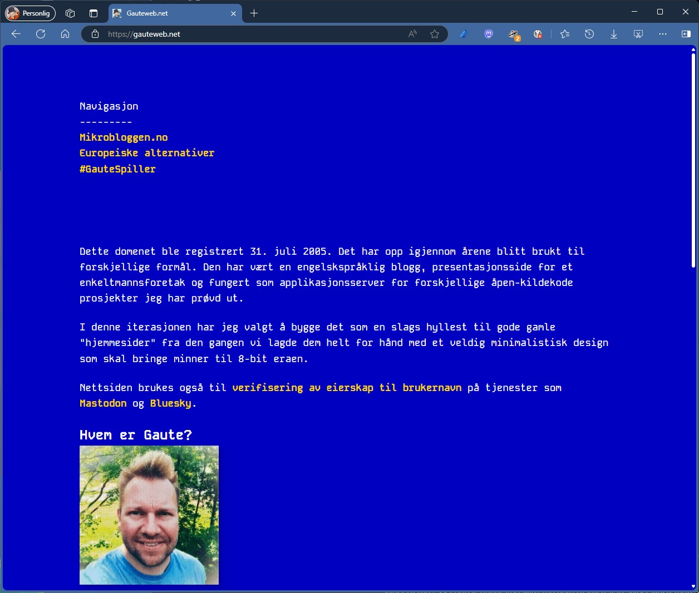

# Gauteweb.net
The source code for gauteweb.net

It's built just for fun, trying to create a very retro feel of how "homepages" was in the nineties, but using modern CSS and HTML5. 

Most of the CSS code is generated with the help of Mistral AI. Most illustration are also mostly created with Mistral AI.

The design is inspired by the C64 CLI interface.

